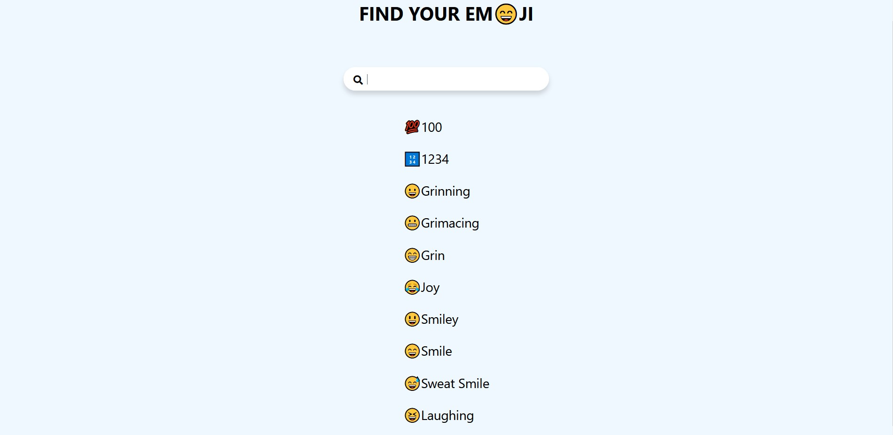

# Find your emoji

Web app in React that allows you to find the emoji you want and directly copy it to your clipboard.



You can find it online [here](https://mathieuelisabeth.github.io/find-your-emoji/)

## Start project

To run the project locally

```
npm init
npm start
```